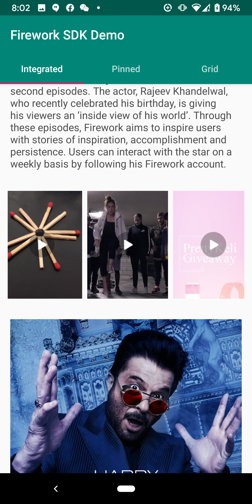
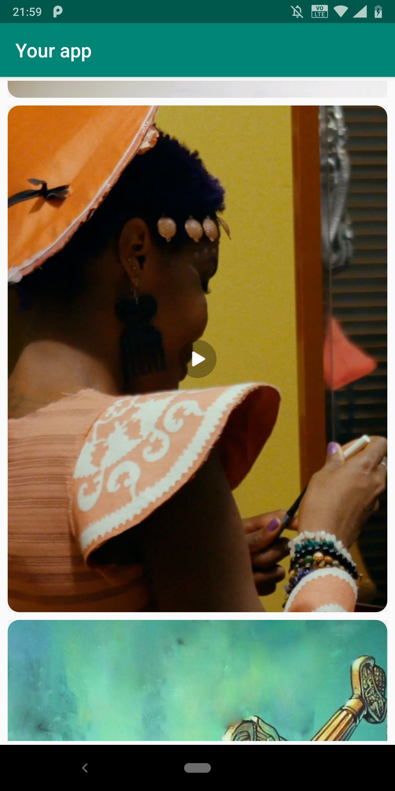
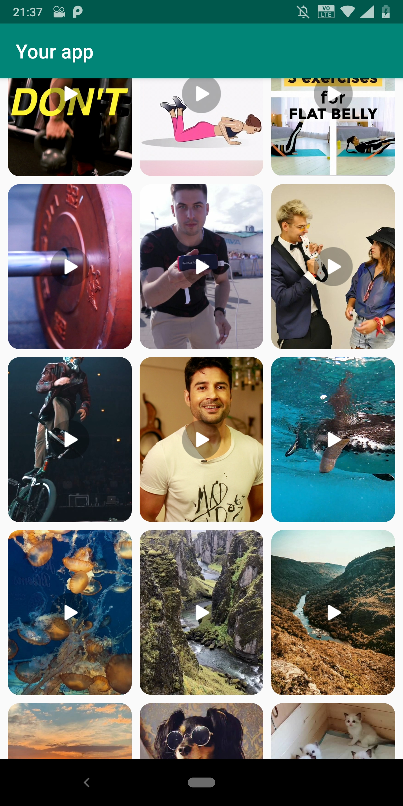
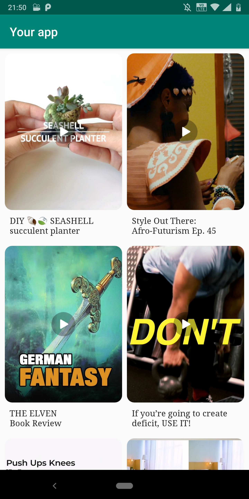

# firework_sdk
firework_sdk is a library to integrate videos from ```Firework - short form video platform``` in your Android application. 

# Prerequisites 
To integrate firework_sdk in your applicaiton, you will have to register your application with Firework platform. You will have to provide <package_name> of your application which can be the same as your application_id or different. Once you register your application, you will be provided with unique app_id. The unique app_id is required to authenticate client with Firework platform. Check more details about its usage in the later sections. 

# Download
Coming soon

# How to use firework_sdk?
firework_sdk provides two options to integrate Firework video feed in your application. It provides easy to use out of box solution wrapped in firework video feed ```fragment``` with limited control over UX/UI that you can drop in your view hierarchy as well as APIs for you to request raw data that you can render it yourself for the complete control over UX/UI. 

* Fragment: 

This is the quickest and easiest way to start seeing the firework video feed in your applicaiton. The fragment will handle initializing ```FireworkSDK```, authenticating your applicaiton with ```Firework platform``` and displaying the video feed in your application. Add the following fragment to your view hierarchy with appropriate layout parameters and attributes and its done.  
				
			<fragment android:id="@+id/{your_fragment_id}"
	   			android:name="com.loopnow.fireworklibrary.views.VideoFeedFragment"
	   			android:layout_width="{your_fragment_width}"
	   			android:layout_height="{your_fragment_height}"
	   			app:showTitle="{true / false}"
	   			app:appid="{provide_your_app_id}"
	   			app:feedLayout="{grid | horizontal | vertical}"
	  			app:columns="{number_of_columns_if_your_feedLayout_is_grid}"
	   			app:textStyle="@style/{your_text_style_for_video_title}" 
           			app:imageStyle="@style/{your_image_style_for_video_thumbnail}"
	   			>
			</fragment>

1. appid : This refers to app_id you received at the time of registering your application with Firework platform. Firework_sdk will throw exception in the absense of appid. It is a compulsory attribute. 

2. feedLayout: This is an optional attribute and specifies the layout for the video feed. feedLayout can take any one of the three availavble layouts. 

* horizontal : Will layout video feed as a single row, scrollable horizontally 

	

* vertical : Will layout video feed as a single column, scrollable vertically 

	 


* grid : will layout video feed in a multiple rows x <columns> format scrollable vertically. If optional attribute app:columns is not specified, the number of columsn default to 2. 

	 


3. columns : This is an optional attribute and is only relevant if feedLayout is grid. The default value of columns is 2. 

4. showTitle: This is an optional attribute and can be either true or false. When true, video title is displayed below thumbnail. The default value is false and no title is displayed. The number of lines of title and the look and feel such as font, text color, text size can be customized with optional attribute app:textStyle

5. textStyle: An optional attribute but we highly recommend you provide style for the video title if you have showTitle attribute set to true. Below an example of textStyle.

app:textStyle="@style/VideoTitleStyle"

	<style name="VideoTitleStyle">
        	<item name="android:textColor">#ff4a4a4a</item>
        	<item name="android:textSize">14dp</item>
        	<item name="android:lines">2</item>
        	<item name="android:gravity">right</item>
        	<item name="android:layout_width">match_parent</item>
        	<item name="android:fontFamily">@font/squeakychalk</item>
   	</style>
  
Note that the value of attribute lines is also applied to maxLines. 

6. imageStyle: An optional attribute that can be used to define corner radius of the image. At present, only radius is supported. 

app:imageStyle="@style/ThumbnailStyle"

	<style name="ImageStyle" >
	       <item name="android:radius">12dp</item>
	</style>
	

# Pagination
When VideoFeedFragment is used, it handles pagination and continuously fetches feed as user scrolls. But if you choose to get raw feed and render it youself, you will have to implement pagination. 


# Video Playback
When user clicks on one of the thumbnails from the video feed integrated in your application, Firework_sdk handles the onClick event and starts the video playback. You will have to include PlaybackActivity in your AndroidManifest file. 
<activity android:name="com.loopnow.fireworklibrary.PlaybackActivity" />
                


# ExampleJava / ExampleKotlin
The example shows you how to use Firework SDK APIs to load video feeds and play with Firework player.

Use ```initialize()``` to initialize Firework SDK, add appid which you received at the time of registering your application.

	fun initialize(applicationContext: Context,
                       appid: String,
                       listener: FireworkInitStatusListener): FireworkSDK
	
Use ```getFeed()``` to get video feed. The response will contain 10 videos.

	fun getFeed(): LiveData<Result>


Use ```loadNext()``` to get next 10 videos.

	fun loadNext()

Use ```playVideo()``` to play video:
* Get your initial feed by ```getFeed()``` 
* Pass the position as a initial video on the player by playVideo().  

	```
	fun playVideo(context: Context, position: Int)


