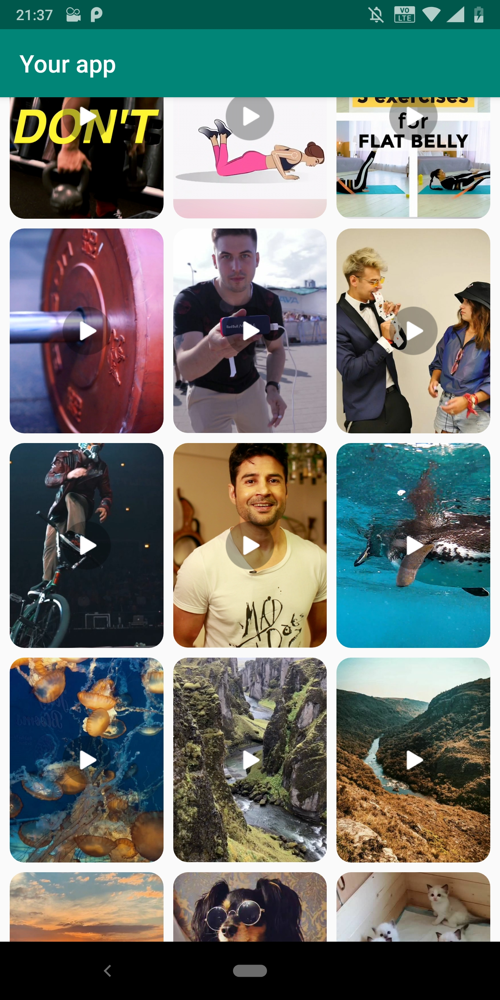
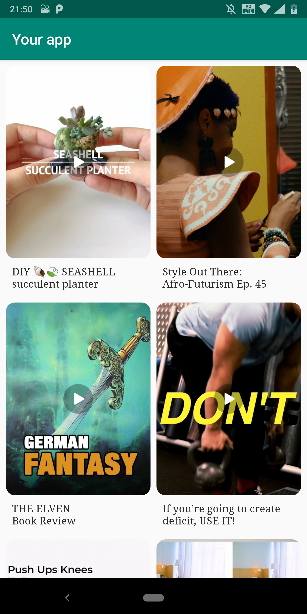
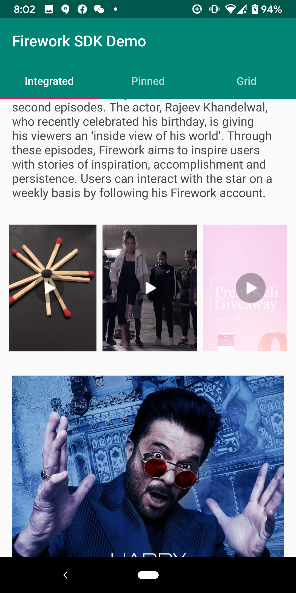
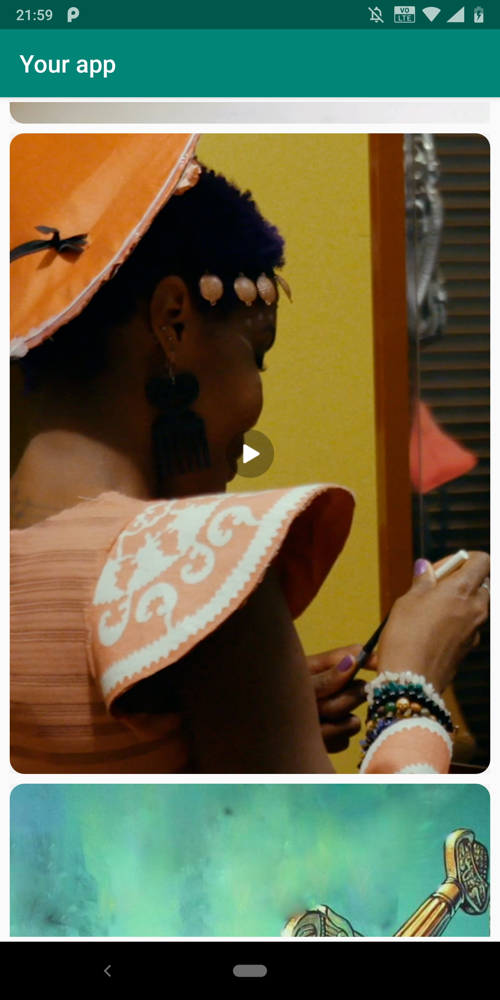
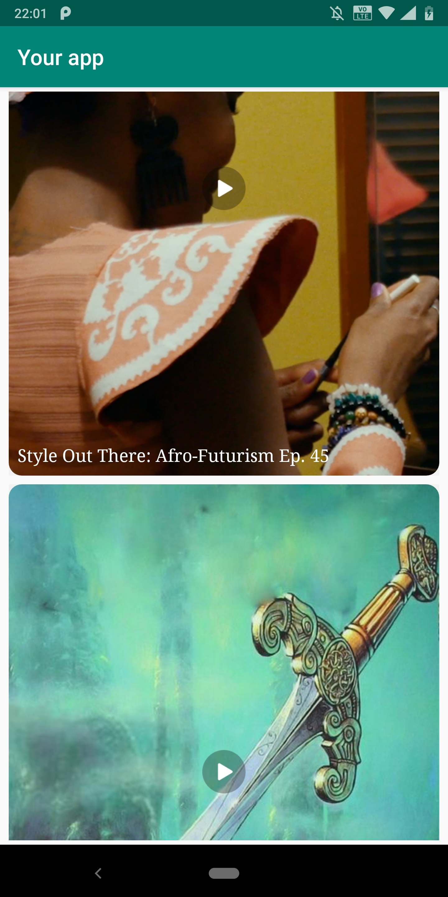

### FireworkSDK
FireworkSDK is a library to integrate video feeds from ```Firework - a short form video platform``` into your Android application. 

### FireworkSDK Demo 
https://github.com/loopsocial/firework_sdk_official/blob/master/FireworkDemo.apk

### Prerequisites 
To integrate FireworkSDK into your application, you have to register your application with Firework platform and get unique
app_id. To get the app_id 

- [X] Provide your application's applicationId / package name to the business team / engineering team you are co-ordinating with. If your applicationId is different from package name, provide applicationId.
- [X] We will email you the app_id.

The app_id is used to authenticate your application with the server. Authentication will fail if your application's applicationId / package name is different from what you provided, or you use wrong app_id. 
 
### How to add library to your project? 

Please select the appropriate version of firework sdk library. 

https://github.com/loopsocial/firework_sdk_official/blob/master/RELEASENOTES.MD


- [X] In AndroidManifest.xml, add 

		<application>	
		....
		....
				// Activity needed for video playback
				<activity
					android:name="com.loopnow.fireworklibrary.PlaybackActivity"
					android:screenOrientation="portrait"
					android:theme="@style/FireworkSDK.NoActionBar.FullScreen" />
			
				// Activity needed for starting a web browser , when CTA on the advertisement is clicked. 
				<activity
					android:name="com.loopnow.fireworklibrary.views.FireworkWebClientActivity"
					android:theme="@style/AppTheme.NoActionBar.FullScreen" />


				// Service used for prefetching of next video , if all data for currently playing video is fetched. 
				<service android:name="com.loopnow.fireworklibrary.views.CacheService" />
				
				// Instead of providing app_id in VideoFeedFragment xml , you can specify it in AndroidManifest.xml
				<meta-data
					android:name="Firework:AppID"
					android:value="{app_id provided to you}" />

				// We plan on using advertising_id to improve target ads so that you can monetize better. 
				// This is needed for to get advertising id using Android ad sdk.  
				<meta-data
					android:name="com.google.android.gms.ads.AD_MANAGER_APP"
					android:value="true" />
			
		</application>
    
- [X] In your application's build.gradle, add 

		dependencies {
			------ other dependencies 
			------ 
			------
			implementation 'com.github.loopsocial:firework_sdk:{latest_version}' 
			
			// Refer to https://github.com/loopsocial/firework_sdk_official/blob/master/RELEASENOTES.MD

		}

		android {
			.....
			.....
		
			dataBinding {
				enabled = true
			}

			compileOptions {
				sourceCompatibility 1.8
				targetCompatibility 1.8
	     		}
		}
	
- [X] In your project's build.gradle, add 
	
	
		allprojects {
			repositories {
			
				--
				---
				--- 
				maven { url 'https://jitpack.io' }
			}
		}
	
- [X] In proguard-rules.pro, add 
		
		-keepclassmembers class com.loopnow.fireworklibrary.** { <fields>; }


### Integrating video feed in your application.  

There are two ways of playing Firework videos in your application.  
1. Display video thumbnails in one of the three available layouts; Vertical, Horizontal & Grid and let user scroll through the thumbnails and click on any to play the video. Once video starts to play user can swipe left or right to play previous or next video. 

2. In the second way, you can skip including the thumbnails and straight away start playing the video. User can swipe left or right to play previous or next video. 


### The following section discusses method 1. 

### VideoFeedView 
If you want to display video thumbnails and start playing the video only after user clicks on one of them, then dropping in VideoFeedView in your view hierarchy is the easiest and quickest way to integrate firework video feed into your app. VideoFeedView displays thumbnails in one of three supported layouts: 

- Vertical
- Horizontal
- Grid

Here is an example of VideoFeedView that you can modify according to your needs and add to view hierarchy. 

			<com.loopnow.fireworklibrary.views.VideoFeedView
	   			android:layout_width="{desired_width}"
	   			android:layout_height="{desired_height}"
	   			app:showTitle="{true or false}"
	   			app:feedLayout="{grid | horizontal | vertical}"
	  			app:columns="{number_of_columns_if_your_feedLayout_is_grid, default value is 2}"
				app:category="{This is in most case not required, please check with your account manager for available categories}"
	   			app:textStyle="@style/{your_text_style_video_title}"
				app:imageStyle="@style/{your_image_style_video_thumbnail}"
			/> 
			
			
				
- {desired_width} : Specify the basic width of the view, this is required attribute. 
- {desired_height} : Specify the basic height of the view, this is required attribute. 
- app:feedLayout={grid | horizontal | vertical} : This attribute specifies the layout for displaying thumbnails. The possible values are 
		
a. Grid -  Will layout video feed in a multiple ```rows> x <columns>``` format. 
It will scroll vertically. If optional attribute ```app:columns``` is not specified, the default columm number is 2. 	
		
 
			
			
b. horizontal -  Will layout video feed as a single row and will function as a horizontal scrollable view.
		  

	
c. vertical - Will layout video feed as a single column and will function as a vertical scrollable view.
		
 
	
We recommend using layout_height="match_parent" when feedLayout is specified as either Vertical or Grid and using definite height defined either as % of the parent viewgroup's height or specified in terms of dp when feedLayout is horizontal 
	       
	       e.g 
	       
	       1. feedLayout="vertical" or feedLaout="grid"
	          layout_height="match_parent"
		  
	       2. feedLayout="horizontal" 
	       	  layout_height="200dp" 
		  
		  or if you are using ConstraintLayout as a parent layout. 
		  
		  layout_height="0dp" 
		  app:layout_constraintHeight_default="percent"
              	 app:layout_constraintHeight_percent="0.40"
		 
d. app:columns - This is an optional attribute and is only relevant if feedLayout is grid. It has default value of 2. 

e. app:showTitle - {true|false} This is an optional attribute. It can be either true or false. The default value is false. When true, video title is displayed. The position of the title is controlled by the attribute ```app:titlePosition```. The text style applied to title, can be specified with optional attribute ```app:textStyle```. 

f. app:textStyle - This is an optional attribute and when specified the style is applied to TextView displaying video title. If textStyle is not specified default style is applied. Below is the example of TextStyle usage. 
	
	```app:textStyle="@style/VideoTitleStyle"```

	<style name="VideoTitleStyle">
        	<item name="android:textColor">#ff4a4a4a</item>
        	<item name="android:textSize">14dp</item>
        	<item name="android:lines">2</item>
	        <item name="android:maxLines">2</item>
        	<item name="android:gravity">left</item>
        	<item name="android:layout_width">match_parent</item>
        	<item name="android:fontFamily">@font/squeakychalk</item>
   	</style>
  

g. app:titlePosition - {alignBottom:below}: When attribute showTitle is set to true, then app:titlePosition="alignBottom" will align the bottom of TextView displaying title to the bottom of the thumbnail and app:titlePosition="below" will align the top of the TextView displaying title to the bottom of the thumbnail. 


h. imageStyle - An optional attribute that can be used to define corner radius of the image. At present, only radius is supported. 

```app:imageStyle="@style/ThumbnailStyle"```

	<style name="ImageStyle" >
	       <item name="android:radius">12dp</item>
	</style>
	
i. app:gutterSpace - When you use layout="grid", gutterSpace is the space between two consecutive columns & rows. By default it is 8dp but you can customize it. 

		<com.loopnow.fireworklibrary.views.VideoFeedView"                  
			app:gutterSpace="{your_desired_value e.g 4dp}"
        		/>

j. app:itemLayout - In VideoFeedView, you can overwrite the default layout used for the feed items i.e thumbnail. Use attribute itemLayout to provide custom layout. 

		<com.loopnow.fireworklibrary.views.VideoFeedView
                  	app:itemLayout="@layout/{your_custom_layout}
        		/>
When you provide your custom layout, it is must that the layout includes TextView with id caption and ImageView with id thumbnail. 

k. app:enableShare - {true|false} if you specify enableShare=true , then sharing of the video is enabled. Share icon is placed at the right|bottom. By default enableShare is true and you can disable it by setting enableShare=false

l. app:category : In case you only want to display videos from certain categories, you can specify one category here. Please note that there are only few categories available and by selecting a categoy you could missing out on millions of amazing videos. Please check with your account manager for the available categories. It is better to not include this attribute, in which case our recommendation engine would recommend videos based on the user interest.  
For example
app:category="Food"

In case if you want to delay loading category and programatically set category, please include attribute 
app:loadContent="false" in your XML defintion of VideoFeedView  and later set category programatically using VideoFeedView api loadContent("category name")
e.g videoFeedView.loadContent("food")

k. app:autoPlayOnFeed - {true | false } The default value is true.  In the VideoFeedView , one of the thumbnails will start playing video without audio and if you don't want this behavior you can turn it off by including this attribute in VideoFeedView. 

m. app:autoPlayOnComplete - { true | false } The default value is false. When video is playing in full screen mode, if you want next video to play as soon as the current one finishes playing then include this attribute in VideoFeedView and set value to true 


### FireworkPlayerFragment 

The first approach using VideoFeedFragment displays video thumbnails and plays video once user clicks on one of the thumbnails but if you don't want to display thumbnails and start playing the video right away, you should drop FireworkPlayerFragment into your view hierarchy. User can swipe right to go to next video and swipe left to go to previous video. 

		<fragment android:layout_width="match_parent"
            		android:layout_height="match_parent"
            		android:name="com.loopnow.fireworklibrary.views.FireworkPlayerFragment"
            		app:appid="{your_app_id}"
            		android:id="@+id/{your_fragment_id}"
            		android:tag="player_fragment"
           		/>


### Callbacks 

The sdk provides two sets of callback, the code below is self explanatory . 
     
      FireworkSDK.addVideoPlaybackTracker(object: FireworkSDK.VideoPlaybackTracker {
            override fun videoWatched(title: String, id: String, duration: Float) {
                // title and duration for which video was  watched 
            }

            override fun nowPlaying(title: String, id: String, duration: Float) {
                
            }
        })
	
    use for versions v4.2.8 and above 
    videoFeedView.addOnItemClickedListener(object: OnItemClickedListener {
                    override fun onItemClicked(
                        index: Int,
                        title: String,
                        id: String,
                        videoDuration: Float
                    ) {
                        Log.v("EventLog", " $index $title $id $videoDuration")
                    }
                })
		

    @Deprecated from version v4.2.8 
    FireworkSDK.addOnItemClickListener(object: VideoFeedAdapter.OnItemClickListener {
   
    	override fun onItemClicked(positionInFeed: Int, title: String, uniqueVideoId: String, duration: Float) {
        	// called when user clicks on one of the thumbnails in the VideoFeedView
    	}
    })

    FireworkSDK.addVideoPlaybackStatusListener(object: FireworkSDK.VideoPlaybackStatusListener {
    	override fun buffering() {
        	// video is bufferring 
    	}

    override fun playing() {
	// video will begin playing 
    }

    override fun duration(duration: Long) {
	// total duration of the video 
    }

    override fun completed() {
	// the complete length of the video has been played 
    }

    override fun currentPosition(currentPosition: Long) {
	// progress as the video is playing 
    }

    override fun nowPlaying(autoPlay:Boolean, index: Int, title: String, encodedId: String) {
	// details of the video that will begin to play 
    }
    
    over fun error(error:String) {
    	// encourntered error while playing a video 
    }
    

})

	 FireworkSDK.addSdkStatusListener(object: FireworkSDK.SdkStatusListener {
            override fun currentStatus(status: SdkStatus, extra: String) {
                Log.v("StatusLog", " {sdk status details  ")
            }

        })
	
### Rewarrded Video Callback

	/**
         * Called when user watches videos for enough duration and earn a reward
         * @param encodedId  Unique video id of firework video. If user watches advertsiement
         * it can be null 
         * @param rewardAmount the number of firework coins that user earned. 
         */
        FireworkSDK.addRewardListener(object: FireworkSDK.RewardListener {
            override fun rewardEarned(encodedId: String?, rewardAmount: Int) {
                Log.v("AdLog", " $encodedId  --> $rewardAmount")
            }

        }, "{pass the unique user id (String) }" )


### Pagination
VideoFeedFragment as well as FireworkPlayerFragment will progressively load small chunk of data as user scrolls the feed ensuring optimized use of network bandwidth.  


### Common Errors 

1. When user clicks on one of the thumbnails from the video feed integrated in your application, FireworkSDK handles the onClick event and starts the video 	playback. If you have not already added PlaybackActivity to your AndroidManifest file, you should. The application will crash without it. 

2. Blank feed - If there is mismatch between application id you provided  or app_id is wrong, authentication will fail and you won't see anything on the screen . You can check this condition using adb logcat | grep NetworkLog 


