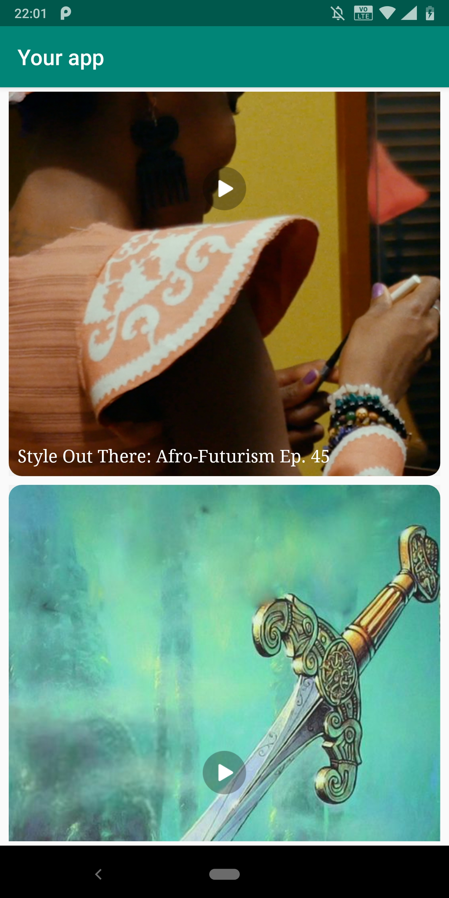

# FireworkSDK
FireworkSDK 是一個用於整合Firework短視頻於您的Android應用程式的應用庫。

## FireworkSDK 範例展示
下載連結: https://github.com/loopsocial/firework_sdk_official/blob/master/FireworkDemo.apk

## 前置需求
在您開始整合FireworkSDK至您的應用程式前，你必須先向Firework團隊註冊的應用程式，以取得您的專屬app_id。步驟如下:

- [X] 提供您Android專案的applicationId或專案名稱給Firework團隊。如果您的applicationId和專案名稱是不同的，請以applicationId為主。

- [X] Firework團隊在收到您的申請需求後，將會發送一組您的app_id.

[註]∶ 此app_id將用於您的應用程式與後台之間的認證，如果您直接套用於非註冊的applicationId或專案名稱，此app_id將無法正常運作。
 

## 如何套用至您的專案? 

版本通知 https://github.com/loopsocial/firework_sdk_official/blob/master/RELEASENOTES.MD
 
- [X] 新增如下(1) - (5)於AndroidManifest.xml  
		<application>	
		....
		....
		
			//(1) 新增播放頁面的 Activity
		 	<activity android:name="com.loopnow.fireworklibrary.PlaybackActivity"
		 		android:screenOrientation="portrait"
		 		android:theme="@style/FireworkSDK.NoActionBar.FullScreen"
		 	/>
			
			//(2) 新增開啟廣告頁面的web Activity 
			<activity android:name="com.loopnow.fireworklibrary.views.FireworkWebClientActivity"
            			android:theme="@style/AppTheme.NoActionBar.FullScreen"
            		/>
			
			//(3) 用於預存影片的Service 
        		<service android:name="com.loopnow.fireworklibrary.views.CacheService" />

			//(4) 新增您的Firework app_id
			<meta-data android:name="Firework:AppID" 
			           android:value="{app_id provided to you}" />
        
			//(5) 為了優化您在廣告項目上的內容及營利，將需此設定取得您應用程試的advertising_id。
			<meta-data
            			android:name="com.google.android.gms.ads.AD_MANAGER_APP"
            			android:value="true"/>
	    
	    
		</application>
    
- [X] 新增FireworkSDK至app的build.gradle

		dependencies {
			------ other dependencies 
			------ 
			------
			implementation 'com.github.loopsocial:firework_sdk:{latest_version}' 
			
			//版本號參照 to https://github.com/loopsocial/firework_sdk_official/blob/master/RELEASENOTES.MD

		}

		android {
			.....
			.....
		
			dataBinding {
				enabled = true
			}

			compileOptions {
				sourceCompatibility 1.8
				targetCompatibility 1.8
	     		}
		}
	
- [X] 新增jitpack.io至project的build.gradle
	
		allprojects {
			repositories {
			
				--
				---
				--- 
				maven { url 'https://jitpack.io' }
			}
		}
	
- [X] 新增如下代碼於 proguard-rules.pro 
		
		-keepclassmembers class com.loopnow.fireworklibrary.** { <fields>; }


  
## 整合影片UI至您應用程式 

您有兩種方式可以整合Firework video到應用程式
- [1] VideoFeedView: 提供影片縮圖清單及播放器畫面。
- [2] FireworkPlayerFragment: 僅使用播放器畫面。


### 1. VideoFeedView: 
提供影片縮圖清單，將影片清單以view的方式整合至您的layout，並且透過點選縮圖後您可以開始播放器觀賞影片。VideoFeedView提供三種配置:

- 垂直 vertical
- 水平 horizontal
- 網格 grid

依據您的需求，可參照以下VideoFeedView範例在layout中做調整: 

	<com.loopnow.fireworklibrary.VideoFeedView
		android:name="com.loopnow.fireworklibrary.views.VideoFeedFragment"
		android:layout_width="{寬}"
		android:layout_height="{高}"
		app:showTitle="{true / false}"
		app:feedLayout="{grid | horizontal | vertical}"
		app:columns="{如果使用grid，加入所需列數}">
		app:category="{非必要欄位，若有影片指定類別需求，請與Firework團隊聯絡。}"
		app:textStyle="@style/{指定文字樣式}"
		app:imageStyle="@style/{指定縮圖樣式}"
	/>
			
- {寬} : 必須定義所需VideoFeedView的寬。
- {高} : 必須定義所需VideoFeedView的高。

- app:feedLayout={grid | horizontal | vertical} : 定義縮圖顯示的樣示。支援的參數如下
		
  1. grid: 影片縮圖將以 ```<欄> x <列>``` 的格式顯示，支援垂直捲動。如果沒有指定```app:columns```，預設值為2。		
 	 
			
			
  2. horizontal: 影片縮圖將以水平方式顯示，支援水平捲動。		  
 	
	
  3. vertical : 影片縮圖將以垂直方式顯示，支援垂直捲動。
  
	 
	
     若您選擇vertical或grid模式,建議使用 layout_height="match_parent"。反之，若是horizontal模式，則提供%或dp。
	       
	       如下: 
	       
	       1. feedLayout="vertical" or feedLayout="grid"
	          layout_height="match_parent"
		  
	       2. feedLayout="horizontal" 
	       	  layout_height="200dp" 
		  
		  若如果使用 ConstraintLayout
		  
		  layout_height="0dp" 
		  app:layout_constraintHeight_default="percent"
                  app:layout_constraintHeight_percent="0.40"
		 
 - app:columns: 此屬性只有在使用grid配置時才有作用，預設值為2。

 - app:showTitle={true|false} : 此為非必要屬性，用於顯示影片標題是否顯示於縮圖上，可根據您的需求選擇開啟標題(true)或關閉標題(false)。

 - app:category: 若無指定影片類別，請忽略此欄位。若需特別指定影片類別，如: Food, Travel, News...請洽Firework團隊取得目前支援的類別清單有哪些。
                 若您想要延遲類別影片顯示的時間點，請於您的VideoFeedView xml中加入app:loadContent="false"，並於程式碼中加入VideoFeedView的API: loadContent("category name")。如: 加入videoFeedView.loadContent("food")於您的程式碼中。
 
 - app:textStyle="@style/{指定文字樣式}": 此為非必要屬性, 用於指定影片標題字型。參考範例如下:
   (1)建立指定字型style。
   (2)填入您的指字style於app:textStyle改變縮圖上的標題字型。
 
	 ```app:textStyle="@style/VideoTitleStyle"```

	    <style name="VideoTitleStyle">
			<item name="android:textColor">#ff4a4a4a</item>
			<item name="android:textSize">14dp</item>
			<item name="android:lines">2</item>
			<item name="android:maxLines">2</item>
			<item name="android:gravity">left</item>
			<item name="android:layout_width">match_parent</item>
			<item name="android:fontFamily">@font/squeakychalk</item>
	    </style>

 - app:titlePosition 
 - app:imageStyle="@style/{指定縮圖樣式}": 此為非必要屬性, 用於指定影片縮圖圓角。目前僅支援圓角設定。參考範例如下:
   (1)建立指定圓角style。
   (2)填入您的縮圖style於app:imageStyle改變縮圖的圓角角度。
   
	 ```app:imageStyle="@style/ThumbnailStyle"```

		<style name="ImageStyle" >
		       <item name="android:radius">12dp</item>
		</style>
	
 
 - app:gutterSpace="指定縮圖的間隔大小": 此屬性用於layout="grid"，影片縮圖的間隔預設為8dp。若需要客制化間隔大小，請參照以下範例:
   
       <com.loopnow.fireworklibrary.views.VideoFeedView"
            app:gutterSpace="{your_desired_value e.g 4dp}"
       />
 
 - app:itemLayout="指定縮圖layout": 此屬性用於指定客制化的縮圖layout。使用此屬性時，請務必加上`@+id/caption`於您的TextView及`@+id/thumbnail`於您的ImageView。
       
       <com.loopnow.fireworklibrary.views.VideoFeedView
	        app:itemLayout="@layout/{your_custom_layout}
	   />

 - app:enableShare - {true | false }: 此屬性用於開啟或關閉分享功能。分享功能預設值為true，並顯示於播放器的右下角，若要關閉`分享`請修改參數為false。
 
 - app:autoPlayOnFeed - {true | false }: 此屬性用於自動播放縮圖的影片。此屬性預設值為true，若無需縮圖影片自動播放，請修改參數為false。
 
 - app:autoPlayOnComplete - { true | false }: 此屬性用於全屏播放器，當目前影片播放完畢後，指定是否直接播放下一個影片。此屬性預設值為false，若需要影片於播放器中自動播放，請修改參數為true。


### 2. FireworkPlayerFragment : 

如果您不需要影片清單，只需要全屏播放器的播放影片介面讓用戶端直接透過左划或右划的手勢來瀏覽影片，您可以選擇以FireworkPlayerFragment的方式，直接整合影片播放器至您的應用程式。

	<fragment android:layout_width="match_parent"
		android:layout_height="match_parent"
		android:name="com.loopnow.fireworklibrary.views.FireworkPlayerFragment"
		app:appid="{your_app_id}"
		android:id="@+id/{your_fragment_id}"
		android:tag="player_fragment"/>

## 回調參數(Callbacks):
  1.取得Firework SDK initialize及目前狀態。
  
    FireworkSDK.addSdkStatusListener(object: FireworkSDK.SdkStatusListener {
        override fun currentStatus(status: SdkStatus, extra: String) {
            Log.v("StatusLog", " {sdk status details  ")
        }
    })
    
  2.從全屏播放器取得目前影片的`觀看時間`。

     FireworkSDK.addVideoPlaybackTracker(object: FireworkSDK.VideoPlaybackTracker {
		override fun videoWatched(title: String, id: String, duration: Float) {
		    // title and duration for which video was watched 
		}

		override fun nowPlaying(title: String, id: String, duration: Float) {

		}
     })
	    
  3. 取得全屏播放器的狀態。

    FireworkSDK.addVideoPlaybackStatusListener(object: FireworkSDK.VideoPlaybackStatusListener {
		 override fun buffering() {
			// video is bufferring 
		 }

		 override fun playing() {
			// video will begin playing 
		 }

		 override fun duration(duration: Long) {
			// total duration of the video 
		 }

		 override fun completed() {
			// the complete length of the video has been played 
		 }

		 override fun currentPosition(currentPosition: Long) {
			// progress as the video is playing 
		 }

		 override fun nowPlaying(autoPlay:Boolean, index: Int, title: String, encodedId: String) {
			// details of the video that will begin to play 
		 }

		 over fun error(error:String) {
			// encourntered error while playing a video 
		 }
     })
     
   4.取得rewarded video的rewoard點數。
   
     /**
     * Called when user watches videos for enough duration and earn a reward
     * @param encodedId  Unique video id of firework video. If user watches advertsiement
     * it can be null 
     * @param rewardAmount the number of firework coins that user earned. 
     */
    FireworkSDK.addRewardListener(object: FireworkSDK.RewardListener {
        override fun rewardEarned(encodedId: String?, rewardAmount: Int) {
            Log.v("AdLog", " $encodedId  --> $rewardAmount")
        }

    }, "{pass the unique user id (String) }" )
    
    
 ## 換頁(Pagination)
 為了確保在有限的頻寬下的瀏覽保質，VideoFeedFragment與FireworkPlayerFragment目前僅預先取得數個影片，再依據新的划動(左划/右划)手勢取得更多新的影片，
 
 ## 常見錯誤(Common Errors)
 1.當使用者點選影片後，Firework SDK將於onClick事件中呼叫全屏播放器。如果您尚未在AndroidManifest中加入`PlaybackActivity`，程序將會崩潰(crash)。
 2.如果啟動Firework SDK後看不到影片，請於Firework團隊確認您的app_id是否已啟用。您也可以開啟`adb logcat | grep NetworkLog` 取得更多資訊。
 


