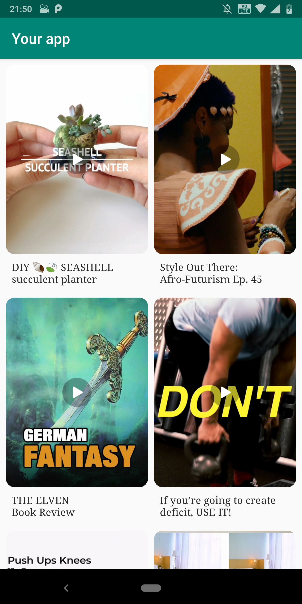

### FireworkSDK
FireworkSDK is a library to integrate video feeds from ```Firework - a short form video platform``` into your Android application. 

### FireworkSDK Demo 
https://github.com/loopsocial/firework_sdk_official/blob/master/FireworkDemo.apk

### Prerequisites 
To integrate FireworkSDK into your applicaiton, you have to register your application with Firework platform and get unique
app_id.
- [X] Provide your application's applicationId / package name to the business team / engineering team you are co-ordinating with. If your applicationId is different from package name, provide applicationId.
- [X] We will email you the app_id.

The app_id is used to authenticate your application with the server. Authentication will fail if your application's applicationId / package name is different from what you provided, or you use wrong app_id. 
 
### How to add library to your project? 

The latest SDK version is 
[](https://jitpack.io/#loopsocial/firework_sdk)

- [X] In AndroidManifest.xml, add 

		<application>	
		....
		....
		
			// Activity needed for video playback when.
		 	<activity android:name="com.loopnow.fireworklibrary.PlaybackActivity"
		 		android:screenOrientation="portrait"
		 		android:theme="@style/FireworkSDK.NoActionBar.FullScreen"
		 	/>
		</application>
    
- [X] In your application's build.gradle, add 

		dependencies {
			------ other dependencies 
			------ 
			------
			implementation 'com.github.loopsocial:firework_sdk:{latest_version}' 
		}

		android {
			.....
			.....
		
			dataBinding {
				enabled = true
			}

			compileOptions {
				sourceCompatibility 1.8
				targetCompatibility 1.8
	     		}
		}
	
- [X] In your project's build.gradle, add 
	
	
		allprojects {
			repositories {
			
				--
				---
				--- 
				maven { url 'https://jitpack.io' }
			}
		}
	
- [X] In proguard-rules.pro, add 
		
		-keepclassmembers class com.loopnow.fireworklibrary.** { <fields>; }


### Integrating video feed in your application.  

There are two ways of integrating Firework video feed in your application. 


1. VideoFeedFragment: If you want to display video thumbnails and start playing the video only after user clicks on one of them, then dropping VideoFeedFragment into your view hierarchy is the easiest and quickest way to integrate firework video feed into your app. VideoFeedFragment displays thumbnails in one of three supported layouts: 

- Vertical
- Horizontal
- Grid

Here is an example of VideoFeedFragment that you can modify according to your needs and add to view hierarchy. 

			<fragment android:id="@+id/{your_fragment_id}"
	   			android:name="com.loopnow.fireworklibrary.views.VideoFeedFragment"
	   			android:layout_width="{your_fragment_width}"
	   			android:layout_height="{your_fragment_height}"
	   			app:showTitle="{true / false}"
	   			app:appid="{your_app_id}"
	   			app:feedLayout="{grid | horizontal | vertical}"
	  			app:columns="{number_of_columns_if_your_feedLayout_is_grid}"
	   			app:textStyle="@style/{your_text_style_for_video_title}" 
           			app:imageStyle="@style/{your_image_style_for_video_thumbnail}">
			</fragment>
			
			
- {your_fragment_id} : Optional fragment id.    
- {your_fragment_width} : Specify the basic width of the view, this is required attribute. 
- {your_fragment_height} : Specify the basic height of the view, this is required attribute. 

- app:feedLayout={grid | horizontal | vertical} : This attribute specifies the layout for displaying thumbnails. The possible values are 
		
		1. grid : Will layout video feed in a multiple <rows> x <columns> format. It will scroll vertically. 
		If optional attribute  ```app:columns``` is not specified, the default columm number defaults to 2. 
		
			 
			
			
		2. horizontal: Will layout video feed as a single row and will function as a horizontal scrollable view.
		  
			
	
		3. vertical : Will layout video feed as a single column and will function as a vertical scrollable view.
		
			 
			
		
	       We recommend using layout_height="match_parent" when feedLayout is specified as either Vertical or Grid and 		  using definite height defined either as % of the parent viewgroup's height or specified in terms of dp when 		       feedLayout is horizontal 
	       
	       e.g 
	       
	       1. feedLayout="vertical" or feedLaout="grid"
	          layout_height="match_parent"
		  
	       2. feedLayout="horizontal" 
	       	  layout_height="200dp" or if you are using ConstraintLayout
		  
		  layout_height="0dp" 
		  app:layout_constraintHeight_default="percent"
                  app:layout_constraintHeight_percent="0.40"
		
- app:appid: This refers to app_id you received at the time of registering your application with Firework platform. FireworkSDK will throw exception in the absense of app_id. It is a must attribute. Please contact Firework, if you don't already have one. 

3. app:columns: This is an optional attribute and is only relevant if feedLayout is grid. It has default value of 2. 

4. app:showTitle={true|false} : This is an optional attribute. It can be either true or false. The default value is false. When true, video title is displayed. The position of the title is controlled by the attribute ```app:titlePosition```. The text style applied to title, can be specified with optional attribute ```app:textStyle```. 

5. app:textStyle: This is an optional attribute and when specified the style is applied to TextView displaying video title. If textStyle is not specified default style is applied. Below is the example of TextStyle usage. 
	
	```app:textStyle="@style/VideoTitleStyle"```

	<style name="VideoTitleStyle">
        	<item name="android:textColor">#ff4a4a4a</item>
        	<item name="android:textSize">14dp</item>
        	<item name="android:lines">2</item>
	        <item name="android:maxLines">2</item>
        	<item name="android:gravity">left</item>
        	<item name="android:layout_width">match_parent</item>
        	<item name="android:fontFamily">@font/squeakychalk</item>
   	</style>
  

6. app:titlePosition={alignBottom:below}: When attribute showTitle is set to true, then app:titlePosition="alignBottom" will align the bottom of TextView displaying title to the bottom of the thumbnail and app:titlePosition="below" will align the top of the TextView displaying title to the bottom of the thumbnail. 


6. imageStyle: An optional attribute that can be used to define corner radius of the image. At present, only radius is supported. 

```app:imageStyle="@style/ThumbnailStyle"```

	<style name="ImageStyle" >
	       <item name="android:radius">12dp</item>
	</style>
	
	
Please refer to source code layout/*.xml to know more about using VideoFeedFragment.  

2. FireworkPlayerFragment : 

The first approach using VideoFeedFragment displays video thumbnails and plays video once user clicks on one of the thumbnails but if you don't want to display thumbnails and start auto-playing the video, you should drop FireworkPlayerFragment into your view hierarchy. 

    


**VideoView**

If you need granular control over UX/UI and integrate Firework SDK the hard way ( which unfortunately is true ), use VideoView. 

VideoView is custom view that encaspulates video playback. You can use VideoView as any other view in your view hierarchy. 

When you use VideoView, you also  
  1. Initialize FireworkSDK 
  2. Get VideoFeed
  3. Initialize VideoView in your adapter ( the one attached to recyclerview or viewpager )  and set video to be played 

This is extra work that you don't need to worry about when using VideoFeedFragment.  

* Initialize FireworkSDK 
	As discussed earlier, you receive appId at the time of registering your application with Firework platform, bundle_id 		is the same as your package name specified in your AndroidManifest and provided at the time of registering your 	application. You also need to provide unique id, which here is created with generateViewId() but you can choose 	another way of creating it. The last argument is FireworkInitStatusListener. 
	
	
		val fireworkSDK = FireworkSDK.initialize(applicationContext, appid, bundle_id, 
			generateViewId(),object : FireworkInitStatusListener {
	
		    override fun onInitializing() {
			 // SDK is in the process of initializing 
		    }

		    override fun onInitCompleted() {
			// Initialization completed. 
			// This is also a good time to request feed                                
		    }

		    override fun onInitFailed(error: String) {
			// Handle error here 
			// Initialization failed. 
		    }
		})
			

* Get VideoFeed	
                        
		fireworkSDK.getVideoFeed().observe(this, Observer {
            it?.let { result ->
                when (result) {
                    is FeedResult.Loading -> {
                        // Loading data from the server.
                    }
                    is FeedResult.Error -> {
                        // Failed to get data from the server.
                    }
                    is FeedResult.Videos -> {
                        // Get data by the result.
                        //val playableList = fireworkSDK.updateLista(oldList,newList,adapter.currentVideo)
			// Once you get the data , either you want to append it or insert it 
			// FireworkSDK provides method to insert data 
			// Use method preparePlayableList 
			// One of the reasons inserting is preferred as opposed to append is incoming list is the latest snapshot of what user may like to watch based on the past information 
			// If you just append it to existing list, the videos that users may like will be qeueued at the very end v/s playing those videos as soon as possible. 
			// pass 1 in case you are using recyclerview in the place of view_pager.offscreenPageaLimit 
			
			if (adapter.videoList.size > 0) {
                            fireworkSDK.preparePlayableList(adapter.videoList, result.videos, adapter.currentVideo, 					view_pager.offscreenPageLimit)
                        } else {
                            may be you can set data to adapter, since adapter data set is empty 
                        }
			// notifyDataSetChanged or whatever is appropriate based on your implementation 
                        //adapter.notifyDataSetChanged()
                    }
                }
            }
        })
	
* Initialize Video View and set Video 

You can initialize VideoView programatically or define in XML layout and inflate the layout hierarchy. You will have to then set videoId of the video using the api call 

		videoView.setVideo(videoId)

VideoView provides api to pause - pause(), resume - resume(), seek -seek(milliseconds), get progress - getProgress(), set video to be played - setVideo(videoId)

Also you can add VideoPlaybackStatusListener to get callbacks when video starts buffering, playing and paused in addition to progress and duration.  
	
	fireworkVideoView.addVideoPlaybackStatusListener(new VideoView.VideoPlaybackStatusListener() {
            @Override
            public void buffering() {
                Log.v("PlaybackLog", "Player buffering");
            }

            @Override
            public void playing() {
                Log.v("PlaybackLog", "Player Playing");

            }

            @Override
            public void paused() {
                Log.v("PlaybackLog", "Player Paused");

            }
	    
	    @Override 
	    fun currentPosition(currentPosition: Long) {
	    	
	    }
	    
	    @Override
            fun duration(duration: Long){
	    }
	
	});

If you are using ViewPager and PagerAdapter, you can inflate your view hierarchy that contains videoview and set video to be played using setVideo method of VideoView. Please refer to example below. This will looks different, depending on your view hierarchy. 

	override fun instantiateItem(collection: ViewGroup, position: Int): Any {
        	val video = videoList[position]
        	val inflater = LayoutInflater.from(context)
        	val layout = inflater.inflate(R.layout.playbackview_item, collection, false) as ViewGroup
        	val videoView = if(layout.childCount > 0) layout.getChildAt(0) as VideoView else null

        	videoView?.apply {
            		setVideo(video)
        	} 
        	collection.addView(layout)
        	return layout
    	}

For FireworkSDK to personalize the video recommendation and do progressive page loading,  it is important to call method nowPlayingVideo of FireworkSDK. If you were using ViewPager you could do something like this - 

	view_pager.addOnPageChangeListener(object : ViewPager.OnPageChangeListener {
            override fun onPageScrollStateChanged(p0: Int) {
            }

            override fun onPageScrolled(p0: Int, p1: Float, p2: Int) {
            }

            override fun onPageSelected(p0: Int) {
                fireworkSDK.nowPlayingVideo(p0, adapter.videoList[p0])
            }
        })


# Pagination
When VideoFeedFragment is used, it handles pagination and continuously fetches feed as user scrolls. But if you choose to get raw feed and render it youself, you will have to implement pagination. 


# Video Playback
When user clicks on one of the thumbnails from the video feed integrated in your application, FireworkSDK handles the onClick event and starts the video playback. You will have to include PlaybackActivity in your AndroidManifest file. 
```<activity android:name="com.loopnow.fireworklibrary.PlaybackActivity" />```
                

# Video Playback Fragment 
In case you want to integrate full screen video playback without the video feed (thumbnails), you can add FireworkPlayerFragment to your view hierarchy. Users can swipe right to watch the next video and swipe left to watch previous video if any available. 

	<fragment android:name="com.loopnow.fireworklibrary.views.FireworkPlayerFragment"
		  android:layout_width="match_parent"
		  android:layout_height="match_parent"
		  app:appid="{your_app_id}"
		  android:id="{your_fragment_id}">
	</fragment>


